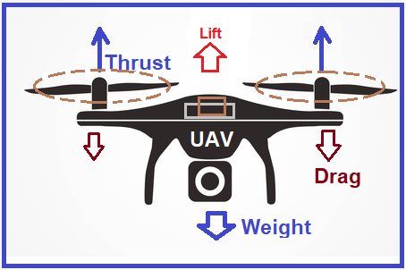
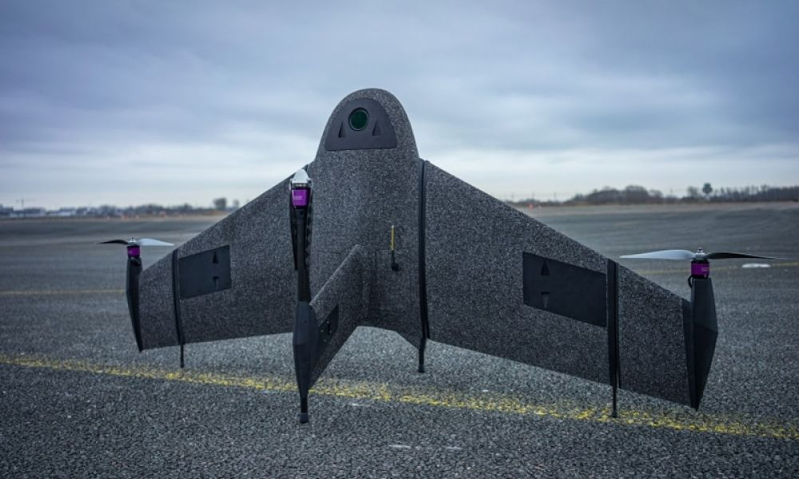
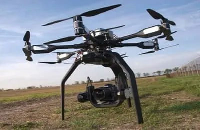
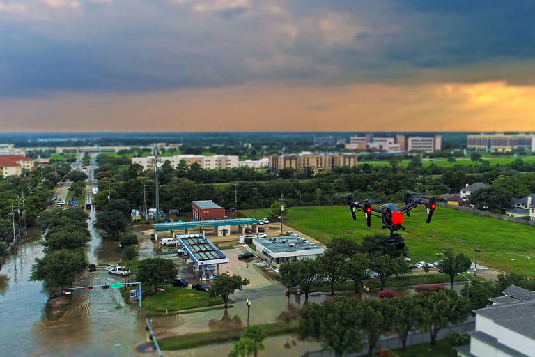
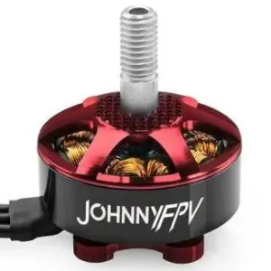
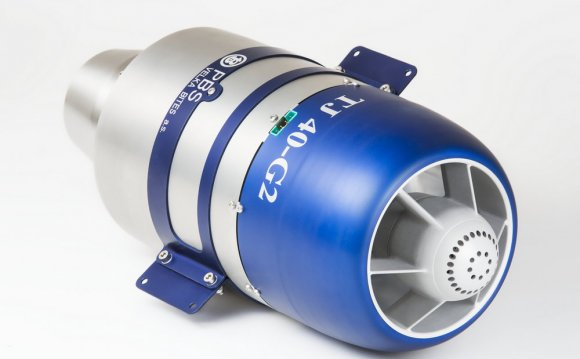
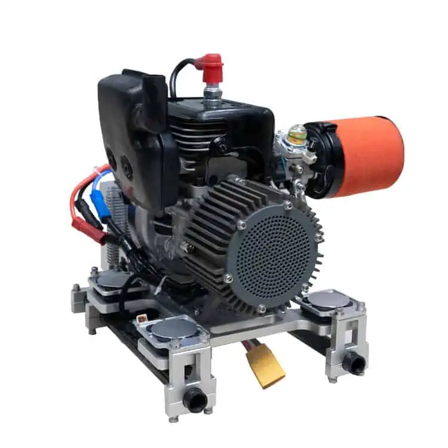

<link rel="stylesheet" href="../static/css/style.css">

# Capitolul 1. Drone. Aspecte Fundamentale ale Zborului

Într-o eră marcată de o dezvoltare cu pași grăbiți a tehnologiei avansată, domeniul dronelor a captat interesul lumii ce a definit o gamă largă de aplicații în care dronele nu doar ridică eficiența, dar și sporesc calitatea și finalizarea mai rapidă a sarcinilor impuse de către utilizator. În acest capitol, îmi propun să simplific înțelegerea dinamicii zborului dronelor, explorând principiile fundamentale, mecanismele de control și varietatea aplicațiilor în diverse domenii.

## 1.1 Principiile de zbor ale dronelor

Pentru a înțelege principiile fundamentale de zbor ale dronelor, pentru început este necesar de a înțelege modul în care o dronă se deplasează în aer liber și care sunt fenomenele fizice care stau la bază. Cunoașterea aspectelor fundamentale permit înțelegerea mecanismului ce ajută la optimizarea performanței aerodinamice, controlul eficient și rezistența de lucru în diverse condiții de zbor și aplicații specifice. Principiile esențiale pot fi:

- **Aerodinamica**: este studierea mișcării aerului în jurul unui obiect pentru calcularea forțelor și a momentelor care acționează asupra obiectului din câmpul de curgere. În cazul analizei aripilor sau a elicelor, problemele de aerodinamică, urmăresc forțele fundamentale ale zborului cum ar fi: portanța, rezistența, forța și greutatea.

- **Portanța și Rezistența**: sunt forțe aerodinamice, care reprezintă forțele ce se opun trecerii corpului solid prin fluxul de aer. Pentru a simplifica calculul parametrilor se pot utiliza modele matematice în care se impune condiția unui corp solid uniform într-un câmp de curgere continuu. Câmpul de curgere continuu poate fi caracterizat de proprietăți cu ar fi: viteza curgerii, presiunea, densitatea și temperatura gazului, care pot fi funcții de poziție și timp. Aceste proprietăți pot fi măsurate direct sau indirect în experimente de aerodinamică sau calculate pornind de la ecuațiile de conservare a masei, impulsului și a energiei în fluxul de aer.

- **Tracțiunea și Propulsia**: tracțiunea presupune forța exercitată pentru mișcarea dronei pe direcțiile de mișcare cum ar fi înainte-înapoi, sus-jos, dreapta-stânga, care trebuie să fie mai mare decât greutatea dronei și greutatea încărcării utile . În funcție de tipul de dronă, aveam tracțiune exercitată de propulsie cu motoare ce antrenează elici exterioare, rotor inter în cazul dronelor jet, cu efect Coandă sau în cazul dronelor fără elice.

::: figure

 Principiul de funcționare

[https://hdzxjbc.com/article/working-principle-and-components-of-drone-cfd-flow-engineering]
:::

- **Greutatea**: greutatea dronelor este forța minimă necesară care se impune la proiectarea dronei. Fiecare componentă a dronei poate influența direct sau indirect calitatea zborului, dificultatea controlului mai ales încărcarea utilă maximă. Încărcarea dronei peste greutatea admisibilă poate duce la unele riscuri inevitabile, cum ar fi: micșorarea timpului de zbor și decalibrarea poziției orizontale.

- **Controlul**: ajustarea turației motoarelor, poziția aripilor, puterea de propulsie și controlul echipamentelor auxiliare, pot fi efectuate de către operator prin intermediul consolelor/dispozitivelor de comandă sau prin modul de auto pilot. Specific aplicațiilor în care se utilizează drona avem nevoie de mecanisme de control simple sau mai complexe, ce pot fi manipulate în mod automat sau de personal calificat.

::: page
:::

## 1.2 Mecanisme de control și stabilizare

Mecanismul de control și stabilizare este constituit din mai multe subsisteme:

- **Giroscopul și accelerometrul**: Aceste dispozitive sunt vitale pentru stabilizarea dronei în timpul zborului. Se utilizează pentru măsurarea și detectarea înclinării, a direcției de zbor. Giroscopul detectează viteza și direcția de rotație, iar accelerometrul măsoară accelerația și schimbările de viteză ale aeronavei.

- **Sistemele de control automat**: Sistemul de pilotare automat include algoritmi și echipamente auxiliare la bordul dronei și poate fi de 2 tipuri: sistem de control automat și semi-automat (zbor asistat), cel automat presupune decolarea din punctul A și aterizarea în punctul B cu crearea independentă a traseului, efectuarea corecției în timp real a poziției și a orientării dronei. Cel semi-automat reprezintă parcurgerea traseului impus de operator prin punctarea poziției pe o hartă virtuală în softul de control, dezavantajul fiind riscul de a pierde semnalul cu drona, decolarea și aterizarea doar manuală. Un algoritm de control întâlnit la dronele de tip copter este aterizarea automată la un nivel critic al bateriei. Un alt algoritm poate fi întâlnit la dronele monoplan care zboară în elipsă căutând semnalul pierdut.

- **Senzori de altitudine și presiune atmosferică**: senzorii care măsoară altitudinea și presiunea atmosferică ajută la menținerea unei altitudini constante în cazul controlului automat și permit ajustarea automată a zborului în funcție de condițiile atmosferice.

- **Sistemul GPS**: Sistemul GPS (Global Positioning System) cum reiese și din denumire este utilizat pentru a obține poziția precisă a dronei pe 3 coordonate, 2 fiind latitudinea și longitudinea, a treia fiind altitudinea. Datele esențiale de poziționare furnizate de modulul GPS sunt utilizate pentru navigare automată, ajută la stabilizarea dronei în timpul zborului și corectarea deviațiilor de la traseul impus în timp real.

Toate aceste mecanisme de control împreună asigură controlul precis al dronei în aer, astfel operatorul primește un zbor asistat mult mai stabil pentru diverse condiții de zbor.

::: page
:::

## 1.3 Tipuri de drone și aplicații specifice

Dronele tip monoplan  își regăsesc utilizarea eficientă la aplicațiile cu zboruri de lungă durată la distanțe mari. Se utilizează des în cartografiere, inspecții și monitorizare extinsă.

::: figure

 Dronă monoplan

[https://www.blacklight.ro/noutati/masuratori-uav-in-conditii-de-vant-de-pana-la-45-km---h/102452]
:::

Dronele cu elice, sunt dronele care utilizează elicele nu doar pentru înaintare, dar și pentru susținerea proprie în aer. Schimbul direcției de zbor și poziționarea dronei pe verticală se obține prin ajustarea turației a motoarelor propulsoare. Sunt cele mai des întâlnite în producție de masă și se utilizează la fotografierea aeriană, filmări, livrări mai nou și în industria agricolă pentru monitorizarea și îngrijirea culturilor .

::: figure

 Drona Agras T10 care pulverizează un câmp

[https://enterprise-insights.dji.com/blog/drones-in-agriculture]
:::

Drone echipate cu elice contra-rotative , denumite și CRP, elice coaxiale contra-rotative, sau elice de mare viteză, aplică puterea maximă a unui singur motor pentru a antrena o pereche de elice coaxiale în contra-rotație. Două elice sunt dispuse una în spatele celeilalte, iar puterea este transferată de la motor printr-o transmisie cu angrenaje planetare sau cu roți dințate. Aceiași idee de contra-rotație a elicelor se poate efectua și prin poziționarea elicei secundare sub brațul pe care este poziționat motorul ce antrenează elicea primară, unde elicea secundară poate fi antrenată de un motor separat. Drone cu rotor dublu sunt cunoscute pentru agilitatea și stabilitatea lor, sunt des utilizate în industria de divertisment și cinematografie.

::: figure

 Aerigon MK II, proiectat pentru utilizare în cinematografe profesionale

[https://www.dronetechplanet.com/what-drones-does-hollywood-use/]
:::

Dronele cu caracteristici speciale sau drone specializate , sunt drone construite pentru o gamă anumită de sarcini, precum dronele subacvatice pentru explorarea adâncimilor marine sau dronele cu capacități de detectare și monitorizare pentru utilizări în cercetare sau apărare. Dronele specializate deseori vin cu echipament auxiliar preinstalat de către producător, ce reduce timpul și investiția în achiziționarea a echipamentelor compatibile.

::: figure

 O dronă care analizează zona afectată de uragan

[https://www.digitaltrends.com/cool-tech/rescue-drones-hurricane-flood-disaster-relief/]
:::

Aceste exemple evidențiază versatilitatea și importanța dronelor într-o gamă largă de industrii și aplicații, ilustrând cum dinamica și caracteristicile specifice ale fiecărui tip de dronă pot fi adaptate pentru a îndeplini diverse scopuri.

## 1.4 Propulsia

Există mai multe tipuri de propulsie utilizate în diferite tipuri de drone, fiecare având avantaje și dezavantaje specifice. Iată câteva tipuri de propulsie întâlnite la drone:

**Motoare electrice**: sunt cele mai comune pentru dronele tip copter, pot fi motoare electrice cu curent continuu (DC)  sau cu curent alternativ (AC) și sunt adesea alimentate de baterii litiu-polimer sau alte surse de energie. Avantajul lor este greutatea totală mică la o putere exercitată mare. Un dezavantaj poate fi prețul ridicat.

::: figure

 Lumenier  2207-7 1750 KV JohnnyFPV V2 motor

[https://www.dronezon.com/learn-about-drones-quadcopters/how-drone-motors-esc-propulsion-systems-work/]
:::

**Motoare cu reacție**: Dronele tip monoplan pot fi echipate cu motoare cu reacție , similare cu cele găsite în avioanele cu reacție. Avantajul motoarelor cu reacție sunt viteze mari la gabarite relativ mici ale dronei. Un dezavantaj poate fi timpul de zbor mai mic ca la dronele cu motoarele electrice la aceleași dimensiuni ale dronei. La gabarite mici ale dronei nu mereu există posibilitatea de a instala un rezervor mai mare pentru combustibil, fapt ce datorează timp de zbor scurt, dar în același timp la vitezele mari exercitate de propulsia cu jet, obținem o distanță parcursă mult mai mare decât la dronele cu motoare electrice.

::: figure

 Jet Engine TJ 40-G2

[http://aiteam.org/SmallPlane/small-jet-engine-kit]
:::

**Motoare hibride**: Unele drone pot combina tehnologiile de motorizare pentru a obține avantajele atât ale motoarelor electrice, cât și ale celor cu combustie internă . Aceste configurații hibride pot asigura o mai mare eficiență energetică sau autonomie extinsă.

::: figure

 FD 2000W Gas powered UAV Hybrid Generator

[https://www.unmannedsystemstechnology.com/company/fly-dragon-drone-tech/fd-2000w-uav-hybrid-generator/]
:::

Fiecare tip de propulsie are avantaje și dezavantaje. De exemplu, motoarele electrice sunt mai ecologice și mai silențioase, dar pot avea o limită în ceea ce privește autonomia din cauza capacității limitate a bateriilor. Motoarele cu combustie internă pot oferi o autonomie mai mare, dar pot fi zgomotoase și mai poluante. Selectarea tipului de propulsie depinde adesea de necesitățile specifice ale dronei și de aplicațiile pentru care este utilizată.

## 1.5 Aspecte legale și etice

Aspectele legale și etice asociate cu utilizarea dronelor sunt fundamentale și vizează normele, reglementările și aspectele morale legate de funcționarea și utilizarea acestor dispozitive aeriene. Aceste aspecte sunt esențiale pentru a asigura o utilizare responsabilă și sigură a dronelor în societate. Drept urmare au fost dezvoltate mai multe reguli și obligații pentru ca să fie posibilă utilizarea tehnologiei date nu doar de companii specializate.

### 1.5.1 Aspecte legale

**Reglementările de zbor**: în multe țări există reglementări specifice privind zborul dronelor, care pot include restricții de altitudine, distanță față de zonele populate sau aeroporturi, și necesitatea de a obține autorizații sau licențe speciale pentru anumite tipuri de activități cu dronele sau categorii de drone în care intră o limitare la specificațiile dronei, esențiale ar fi cele de viteza maximă de zbor, greutatea și zgomotul provocat.

**Confidențialitate și drepturile individuale**: utilizarea dronelor cu echipamente de înregistrare video pot fi utilizate în scopuri mai puțin legale cum ar fi supravegherea zonelor private, ce pune în pericol confidențialitatea firmei/persoanei supravegheate. În multe țări utilizarea dronelor în zone publice sau private, poate fi interpretată ca încălcarea drepturilor și intimitatea oamenilor.

**Siguranța și responsabilitatea**: ținând cont de popularitatea și extinderea pe piață există o gamă largă de drone, care pot fi achiziționate de o persoană necalificată. Operatorii de drone sunt responsabili pentru siguranța și evitarea prejudiciilor sau accidentelor. Respectarea regulilor și instrucțiunilor de zbor este esențială pentru a preveni incidentele.

### 1.5.2 Aspecte etice

**Utilizare militară și securitate**: utilizarea dronelor în scopuri militare sau pentru supravegherea și controlul populației poate ridica întrebări etice legate de etica războiului și drepturile omului.

**Impactul asupra mediului**: dronele pot avea un impact asupra mediului înconjurător, în special atunci când sunt utilizate în zone naturale sau sensibile. Zgomotul, poluarea și deranjul pot afecta fauna și flora locală.

Operatorii de drone trebuie să fie conștienți de aspectele legale și etice asociate utilizării acestor dispozitive și să opereze în conformitate cu reglementările locale și cu principiile etice pentru a asigura utilizarea lor responsabilă și respectuoasă.

::: page
:::

## 1.6 Viitorul dronelor

Viitorul dronelor este extrem de fascinant și plin de promisiuni în ceea ce privește dezvoltarea tehnologică și diversificarea utilizărilor lor. Câteva direcții majore în evoluția dronelor includ:

**Autonomie extinsă**: dezvoltarea capacității bateriilor utilizate în drone, va extinde autonomia dronelor și durata de zbor, ce poate juca un rol important în extinderea domeniului de aplicare al acestora și vor face utilizarea lor mai viabilă pentru o gamă mai largă de aplicații.

**Integrarea IA**: integrarea inteligenței artificiale în sistemul dronei, va permite dronelor să funcționeze în regim autonom fără a fi necesară intervenția omului pentru încărcarea dronei sau pentru control și navigare. Având un sistem artificial la bordul dronei care poate corecta și crea ruta de zbor, va eficientiza executarea sarcinilor complexe în diverse domenii, de la agricultură la livrări și monitorizare. Dronele vor deveni mai inteligente și mai capabile, ce va reduce intervenția umană pentru perioade mai lungi de timp și în medii complexe.

**Tehnologii de evitare a coliziunilor**: există deja metode de protejare a elicei, ranforsarea carcasei, însă nu toate sistemele pot preveni distrugerea completă a dronei. În continuare se dezvoltă sisteme avansate de detecție și evitare a coliziunilor ce contribuie la creșterea siguranței și a fiabilității dronei, permițând să fie operată în zone aglomerate sau în condiții dificile cu un sistem de co-pilotare.

**Diverse aplicații în industrie**: dronele vor continua să se extindă în diverse domenii, inclusiv în domeniul medical (livrări de medicamente sau echipamente medicale de urgență), construcții (inspecții și monitorizare), precum și în spațiul urban pentru livrări și supraveghere.

**Miniaturizare și inovații în design**: dronele vor deveni mai mici, mai ușoare și mai portabile, deschizând noi posibilități pentru utilizarea lor în spații restrânse sau pentru aplicații personale și recreative.

În ansamblu, viitorul dronelor se profilează ca fiind unul în care aceste dispozitive aeriene vor juca un rol tot mai important în numeroase aspecte ale vieții noastre, aducând cu sine beneficii semnificative în domeniile tehnologiei, economiei și societății în general.

