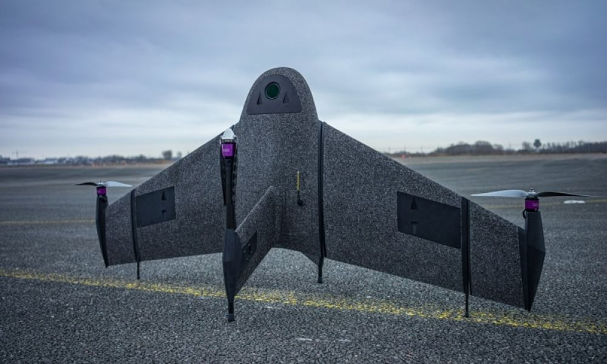
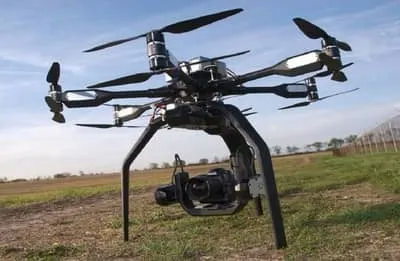

<link rel="stylesheet" href="../static/css/style.css">

# Capitolul 1. Aspecte Fundamentale ale Zborului Dronelor

Într-o eră marcată de o dezvoltare cu pași grăbiți a tehnologiei avansată, domeniul dronelor a captat interesul lumii ce a definit o gamă largă de aplicații în care dronele nu doar ridică eficiența, dar și sporesc calitatea și finalizarea mai rapidă a sarcinilor impuse de către utilizator. În acest capitol, îmi propun să simplific înțelegerea dinamicii zborului dronelor, explorând principiile fundamentale, mecanismele de control și varietatea aplicațiilor în diverse domenii.

## 1.1 Principiile de zbor ale dronelor

Pentru a înțelege principiile fundamentale de zbor ale dronelor, pentru început este necesar de a înțelege modul în care o dronă se deplasează în aer liber și care sunt fenomenele fizice care stau la bază. Cunoașterea aspectelor fundamentale permit înțelegerea mecanismului ce ajută la optimizarea performanței aerodinamice, controlul eficient și rezistența de lucru în diverse condiții de zbor și aplicații specifice. Principiile esențiale pot fi:

- **Aerodinamica**: este studierea mișcării aerului în jurul unui obiect pentru calcularea forțelor și a momentelor care acționează asupra obiectului din câmpul de curgere. În cazul analizei aripilor sau a elicelor, problemele de aerodinamică, urmăresc forțele fundamentale ale zborului cum ar fi: portanța, rezistența, forța și greutatea.

- **Portanța și Rezistența**: sunt forțe aerodinamice, care reprezintă forțele ce se opun trecerii corpului solid prin fluxul de aer. Pentru a simplifica calculul parametrilor se pot utiliza modele matematice în care se impune condiția unui corp solid uniform într-un câmp de curgere continuu. Câmpul de curgere continuu poate fi caracterizat de proprietăți cu ar fi: viteza curgerii, presiunea, densitatea și temperatura gazului, care pot fi funcții de poziție și timp. Aceste proprietăți pot fi măsurate direct sau indirect în experimente de aerodinamică sau calculate pornind de la ecuațiile de conservare a masei, impulsului și a energiei în fluxul de aer.

- **Tracțiunea și Propulsia**: tracțiunea presupune forța exercitată pentru mișcarea dronei pe direcțiile de mișcare cum ar fi înainte-înapoi, sus-jos, dreapta-stânga, care trebuie să fie mai mare decât greutatea dronei și greutatea încărcării utile. În funcție de tipul de dronă, aveam tracțiune exercitată de propulsie cu motoare ce antrenează elici exterioare, rotor inter în cazul dronelor jet, cu efect Coandă sau în cazul dronelor fără elice. 

- **Greutatea**: greutatea dronelor este forța minimă necesară care se impune la proiectarea dronei. Fiecare componentă a dronei poate influența direct sau indirect calitatea zborului, dificultatea controlului mai ales încărcarea utilă maximă. Încărcarea dronei peste greutatea admisibilă poate duce la unele riscuri inevitabile, cum ar fi: micșorarea timpului de zbor și decalibrarea poziției orizontale.

- **Control**: ajustarea turației motoarelor, poziția aripilor, puterea de propulsie și controlul echipamentelor auxiliare, pot fi efectuate de către operator prin intermediul consolelor/dispozitivelor de comandă sau prin modul de auto pilot. Specific aplicațiilor în care se utilizează drona avem nevoie de mecanisme de control simple sau mai complexe, ce pot fi manipulate în mod automat sau de personal calificat.

## 1.2 Mecanisme de control și stabilizare

Mecanismul de control și stabilizare este constituit din mai multe sisteme primare:

- **Giroscopul și accelerometrul**: Aceste dispozitive sunt vitale pentru stabilizarea dronei în timpul zborului. Se utilizează pentru măsurarea și detectarea înclinării, a direcției de zbor. Giroscopul detectează viteza și direcția de rotație, iar accelerometrul măsoară accelerația și schimbările de viteză ale aeronavei.

- **Sistemele de control automat**: Sistemul de pilotare automat include algoritmi și echipamente auxiliare la bordul dronei și poate fi de 2 tipuri: sistem de control automat și semi-automat (zbor asistat), cel automat presupune decolarea din punctul A și aterizarea în punctul B cu crearea independentă a traseului, efectuarea corecției în timp real a poziției și a orientării dronei. Cel semi-automat reprezintă parcurgerea traseului impus de operator prin punctarea poziției pe o hartă virtuală în softul de control, dezavantajul fiind riscul de a pierde semnalul cu drona, decolarea și aterizarea doar manuală. Un algoritm de control întâlnit la dronele de tip copter este aterizarea automată la un nivel critic al bateriei. Un alt algoritm poate fi întâlnit la dronele monoplan care zboară în elipsă căutând semnalul pierdut.

- **Senzori de altitudine și presiune atmosferică**: senzorii care măsoară altitudinea și presiunea atmosferică ajută la menținerea unei altitudini constante în cazul controlului automat și permit ajustarea automată a zborului în funcție de condițiile atmosferice.

- **Sistemul GPS**: Sistemul GPS (Global Positioning System) cum reiese și din denumire este utilizat pentru a obține poziția precisă a dronei pe 3 coordonate, 2 fiind latitudinea și longitudinea, a treia fiind altitudinea. Datele esențiale de poziționare furnizate de modulul GPS sunt utilizate pentru navigare automată, ajută la stabilizarea dronei în timpul zborului și corectarea deviațiilor de la traseul impus în timp real.

Toate aceste mecanisme de control împreună asigură controlul precis al dronei în aer, astfel operatorul primește un zbor asistat mult mai stabil pentru diverse condiții de zbor.

## 1.3 Tipuri de drone și aplicații specifice 

Dronele tip monoplan fig. 1.1 își regăsesc utilizarea eficientă la aplicațiile cu zboruri de lungă durată la distanțe mari. Se utilizează des în cartografiere, inspecții și monitorizare extinsă.

::: figure

**Fig 1.1** Dronă monoplan

[https://www.blacklight.ro/noutati/masuratori-uav-in-conditii-de-vant-de-pana-la-45-km---h/102452]
:::

Dronele cu elice, sunt dronele care utilizează elicele nu doar pentru înaintare, dar și pentru susținerea proprie în aer. Schimbul direcției de zbor și poziționarea dronei pe verticală se obține prin ajustarea turației a motoarelor propulsoare. Sunt cele mai des întâlnite în producție de masă și se utilizează la fotografierea aeriană, filmări, livrări mai nou și în industria agricolă pentru monitorizarea și îngrijirea culturilor.

::: figure

**Fig. 1.2** Drona Agras T10 care pulverizează un câmp

[https://enterprise-insights.dji.com/blog/drones-in-agriculture]
:::

Drone echipate cu elice contra-rotative fig. 1.3, denumite și CRP, elice coaxiale contra-rotative, sau elice de mare viteză, aplică puterea maximă a unui singur motor pentru a antrena o pereche de elice coaxiale în contra-rotație. Două elice sunt dispuse una în spatele celeilalte, iar puterea este transferată de la motor printr-o transmisie cu angrenaje planetare sau cu roți dințate. Aceiași idee de contra-rotație a elicelor se poate efectua și prin poziționarea elicei secundare sub brațul pe care este poziționat motorul ce antrenează elicea primară, unde elicea secundară poate fi antrenată de un motor separat. Drone cu rotor dublu sunt cunoscute pentru agilitatea și stabilitatea lor, sunt des utilizate în industria de divertisment și cinematografie.

::: figure

**Fig. 1.3** Aerigon MK II, proiectat pentru utilizare în cinematografe profesionale

[https://www.dronetechplanet.com/what-drones-does-hollywood-use/]
:::

Dronele cu caracteristici speciale sau drone specializate fig. 1.4, sunt drone construite pentru o gamă anumită de sarcini, precum dronele subacvatice pentru explorarea adâncimilor marine sau dronele cu capacități de detectare și monitorizare pentru utilizări în cercetare sau apărare. Dronele specializate deseori vin cu echipament auxiliar preinstalat de către producător, ce reduce timpul și investiția în achiziționarea a echipamentelor compatibile.

::: figure 

Fig. 1.2 O dronă care analizează zona afectată de uragan

[https://www.digitaltrends.com/cool-tech/rescue-drones-hurricane-flood-disaster-relief/]
:::

Aceste exemple evidențiază versatilitatea și importanța dronelor într-o gamă largă de industrii și aplicații, ilustrând cum dinamica și caracteristicile specifice ale fiecărui tip de dronă pot fi adaptate pentru a îndeplini diverse scopuri.

## 1.4 Energie și propulsie

Discută despre diferitele tipuri de motoare și surse de energie utilizate în drone, cum ar fi motoarele electrice sau motoarele cu combustie internă, și avantajele și dezavantajele fiecăruia.

## 1.5 Aspecte legale și etice

Poți explora reglementările actuale referitoare la zborul cu drone, precum și aspectele legale și etice legate de confidențialitate, securitate și impactul asupra mediului în care operează dronele.

## 1.6 Viitorul dronelor

Poate fi interesant să discuți despre direcțiile viitoare în dezvoltarea dronelor, cum ar fi autonomia, inteligența artificială aplicată, durata de zbor extinsă și integrarea în societate.

