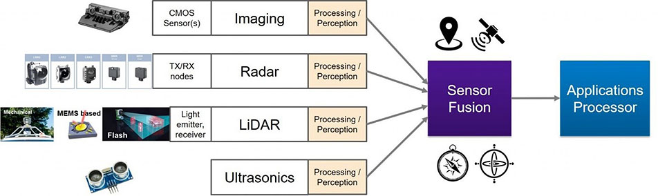

<link rel="stylesheet" href="../static/css/style.css">

# Capitolul 2 Sisteme și tehnologii ale dronelor

## 2.1 Analiza detaliată a manevrabilității

### 2.1.1 Designul și configurarea

Pentru a înțelege modul în care designul structural al unei drone influențează manevrabilitatea, trebuie să analizăm aspectele precum greutatea, dimensiunile, distribuția motorului și a greutății, forma și flexibilitatea componentelor pentru a oferi performanțe optime în ceea ce privește manevrabilitatea lor:

::: figure

 Dinamica dronei

[https://control.com/technical-articles/a-technical-overview-of-drones-and-their-autonomous-applications/]
:::

*Configurația motoarelor și elicei:* Modul în care motoarele sunt plasate și orientate pe brațele dronei afectează puterea și controlul acesteia. La proiectarea elicelor pot apărea niște constrângeri care pe viitor vor determina gradul de libertate și manevrabilitate sau stabilitate, configurarea lor fiind crucială pentru agilitate și răspuns rapid în timpul zborului.

*Forma și aerodinamica:* Designul aerodinamic la o dronă nu presupune doar proiectarea elicelor, cât și proiectarea carcasei care la urma ei este influențată direct de gabarite, greutate, aplicații și zona în care se va utiliza această dronă. Forma influențează direct stabilitatea dronei în timpul zborului datorate de rezistența la vânt și capacitatea de a efectua manevre precise. Unele modele sunt create pentru a fi mai stabile și predictibile, în timp ce altele sunt proiectate pentru agilitate și manevrabilitate sporită.

*Materialele și construcția:* Materialele din care sunt construite dronele trebuie să corespundă la anumite cerințe de durabilitate, flexibilitate, preț, disponibilitate și greutate. Aceste condiții sunt impuse nu atât de producător care tinde să dezvolte un produs mai eficient cât sunt impuse de modul de utilizare a dronelor și riscurile la care sunt expuse. Un dezavantaj a materialelor utilizate pot fi influența lor la greutatea, durabilitatea și chiar flexibilitatea sa. Un design robust poate oferi stabilitate și o protecție la casări, pe când materialele mai flexibile pot îmbunătăți manevrabilitatea în anumite condiții.

*Greutatea și distribuția acesteia:* Greutatea componentelor are un impact semnificativ asupra manevrabilității. O distribuție echilibrată a greutății poate influența stabilitatea și capacitatea de manevrare. Modul în care sunt amplasate și echilibrate bateriile, componentele precum camerele sau alte accesorii pot influența comportamentul în zbor. La o greutate mai mare decât cea impusă ca greutatea maximă în timpul proiectării pot modifica momentele de inerție.

*Sistemele de amortizare și senzorii:* Sistemele de amortizare și senzorii reprezintă două componente importante în dinamica și stabilitatea dronei, contribuind la asigurarea unui zbor precis și sigur. Amortizarea loviturilor eficientă reduce vibrațiile și perturbările în timpul zborului, îmbunătățind astfel stabilitatea și manevrabilitatea dronei în condiții variate de mediu și de viteză. Senzorii precum: giroscopul, accelerometru și sistemul de poziționare, furnizează date esențiale pentru algoritmii de control. Analiza poziției, orientarea și mișcarea în timp real, facilitează astfel deciziile rapide și corecte în timpul zborului pentru a menține controlul și stabilitatea în aer.

### 2.1.2 Sisteme de control și algoritmi

Sistemele de control și algoritmii reprezintă baza funcționării unei drone și au un impact semnificativ asupra manevrabilității. Sistemele de stabilizare, senzorii și algoritmul de stabilizare joacă un rol important în asigurarea unei manevrabilități precise. Iată câteva aspecte esențiale ale sistemului de control:

::: figure

 Sistemul de control autonom

[https://control.com/technical-articles/a-technical-overview-of-drones-and-their-autonomous-applications/]
:::

*Sisteme de stabilizare:* Sistemul fundamental pentru menținerea unei drone stabile în timpul zborului reprezintă *giroscopul*. Giroscopul, accelerometrul sunt utilizați pentru a detecta și a corecta automat orice deviație sau schimbare a poziției, ce contribuie astfel la stabilitate și manevrabilitate în zbor.

*Algoritmi de control:* Algoritmii de control sunt responsabili pentru procesarea datelor trimise de către senzori, după care sunt generate comenzi pentru motoarele și elicele dronei. În cazul dronelor operate de către om, omul nu reușește vizual să determine poziția dronei sau riscurile la care este expusă la schimbări în mediu și la comenzi neadecvate din partea operatorului, pentru a evita coleziunile sau răsturnarea dronei, algoritmii de control au rolul de co-pilotare care ajută la stabilizare și asigură manevrabilitate adecvată.

*Controlul automat versus manual:* Controlul automat și manual implică abordări distincte în gestionarea zborului. Controlul automat utilizează algoritmi și sisteme de navigație pentru a prelucra și executa comenzi într-un mod predefinit, eliminând intervenția umană directă. Acest lucru permite dronei să execute sarcini complexe în mod autonom, bazându-se pe setările și instrucțiunile programate. Pe de altă parte, controlul manual implică intervenția directă a unui operator uman care manevrează și dirijează dronele folosind un controler sau o interfață similară. Acest mod oferă operatorului control și flexibilitate mai mare în ceea ce privește manevrabilitatea și răspunsul dronei, permițând ajustări în timp real în funcție de cerințele specifice ale zborului sau ale mediului.

Ambele abordări au avantaje și dezavantaje. Controlul automat poate fi util în operațiuni repetitive și predefinite, oferind consistență și precizie în execuție. Pe de altă parte, controlul manual oferă flexibilitate și adaptabilitate în situații complexe sau imprevizibile, permițând operatorului să ia decizii rapide și să ajusteze comportamentul dronei în timp real. O combinație eficientă a acestor două modalități poate duce la o funcționare mai eficientă și mai versatilă a dronei într-o gamă largă de situații și aplicații.

### 2.2.3 Performanța în diferite medii

Analizând performanța dronei în medii variate, scopul principal poate fi să examinăm modul în care dronele se adaptează și răspund la condiții diferite ale mediului ambiant:

*Zborul în condiții meteorologice variate:* presupune adaptabilitate și rezistență din partea dronei în fața schimbărilor atmosferice. Drona trebuie să facă față vânturilor puternice, ploii, temperaturilor extreme și chiar zăpezii sau ceții. Sistemele avansate de control și senzorii de precizie sunt esențiali pentru a naviga și a răspunde corect la aceste condiții variabile, garantând un zbor sigur și eficient.

*Mediul urban vs. rural:* În zonele urbane, există mai multe obstacole, precum clădiri înalte și trafic intens, ceea ce necesită senzori avansați și capacitatea de a evita obstacolele pentru a naviga în siguranță. În mediile rurale, spațiile deschise și lipsa obstacolelor pot permite zboruri mai libere, dar pot apărea provocări legate de condițiile meteo sau accesibilitatea terenurilor.

*Zborul în interior vs. exterior:* În interior, dronele trebuie să fie extrem de precise și să aibă capacitatea de a naviga în spații strânse, evitând obiectele și respectând reguli precise de siguranță. Pe de altă parte, zborul în exterior poate aduce provocări legate de vânturi puternice, schimbări rapide de iluminare sau interfețe radio într-un mediu deschis.

*Rezistența la condiții extreme:* Rezistența la condiții extreme presupune capacitatea dronei de a funcționa în medii dificile, cum ar fi temperaturile extreme, umiditatea sau altitudinea ridicată. Sistemele de propulsie, bateriile și materialele rezistente sunt esențiale pentru a asigura performanța dronei în astfel de condiții.

*Lumina și vizibilitatea:* Lumina și vizibilitatea sunt critice pentru zborul sigur și eficient al dronei. Capacitatea de a detecta obstacolele, de a evalua corect distanțele și de a se orienta în funcție de iluminare reprezintă aspecte vitale pentru navigarea precisă, fie că este vorba de zbor în timpul zilei sau în condiții de lumină scăzută.

*Factori de mediu suplimentari:* Factorii de mediu suplimentari, cum ar fi interferențele radio, poluarea electromagnetică sau perturbările din medii industriale, pot influența semnificativ funcționarea dronei. Capacitatea de a rezista și a se adapta la acești factori adiționali poate determina performanța și fiabilitatea dronei în diferite situații și medii de operare.

### 2.2.4 Simulare și testare

Procesul de simulare și testare presupune analiza și previzualizarea funcționării dronei într-un sistem virtual înainte de crearea modeului fizic. Simularea virtuală permite îmbunătățirea manevrabilității și comportamentului dronei prin simularea zborului în diferite situații din cadrul aplicațiilor la care va fi utilizată, prin optimizarea controlului și/sau modificarea parțială a construcției permite eficientizarea produsului final. Pentru a efectua o simulare și testare decentă, avem nevoie de a parcurge următorii pași:

1. *Modelarea și simularea:* Modelarea și simularea presupune crearea modelelor matematice și simulările computerizate pentru a reproduce comportamentul dronei în diverse situații. Analizarea parametriilor dronei pe fiecare subansamblu, poate aduce noi îmbunătățiri la stadiu de proiectare. Totuși un sistem matematic nu poate include toate variabilele existente, aici avem constrângeri nu doar la complexitatea sistemelor de ecuații utilizate cât și dificultatea de a executa o simulare complexă pe generațiile de calculatoare curente.

2. *Testarea în medii controlate:* Testarea în medii controlate implică evaluarea performanțelor și comportamentului dronei în condiții simulate sau reglate în mod specific. Aceste medii reproduc condiții specifice de zbor, precum vânturi puternice, temperaturi extreme sau obstacole, permițând inginerilor și dezvoltatorilor să evalueze reacțiile și capacitatea dronei de a face față acestor situații într-un mediu controlat și sigur. Testele în medii controlate sunt esențiale pentru verificarea și îmbunătățirea sistemelor de control, a senzorilor și a algoritmilor de zbor, contribuind la dezvoltarea și perfecționarea dronei înainte de implementarea sa în medii reale.

3. *Testarea în condiții reale:* Testarea în condiții reale implică evaluarea comportamentului și performanțelor dronei în medii și situații reale de zbor. Aceste teste se desfășoară în exterior, în diverse locații și condiții meteo reale, inclusiv în medii urbane, rurale sau în alte medii specifice. Ele permit observarea comportamentului dronei în situații reale și evaluarea modului în care aceasta se adaptează la schimbările din mediu, contribuind la validarea și îmbunătățirea sistemelor și a performanțelor sale în condiții concrete de operare.

4. *Verificarea și validarea simulărilor:* Verificarea și validarea simulării urmărește gradul de acuratețe și relevanță a rezultatelor obținute în urma simulării cu datele obținute experimental. Această verificare determină un nouă iterație de îmbunătățire a designului prin aducerea modelului final la condiții apropiate de limitele impuse la proiectare. Invalidarea simulării poate fi datorată de situația în care datele rezultate în urma simulării sunt irelevante cu cele obținute experimental.

5. *Iterația și îmbunătățirea designului:* Comparația rezultatelor pot impune o schimbare drastică în construcția dronei, cum ar fi schimbul propulsiei, recalibrarea motoarelor, schimbul elicelor, cel mai nedorit fiind necesitatea de a reproiecta construcția dronei. Totodată îmbunătățirea designului și algoritmii dronei, poate ridica gradul de calitate a produsului fina. Scopul iterațiilor de îmbunătățire determină optimizarea manevrabilității și comportamentul în zbor.

6. *Implementarea rezultatelor în producție:* Implementarea rezultatelor în producție reprezintă procesul de integrare a inovațiilor și îmbunătățirilor obținute în timpul testelor și dezvoltării într-un cadru practic și funcțional. Acest proces implică adesea optimizarea tehnologiilor, a algoritmilor sau a componentelor dronei pentru a fi fabricate în serie și utilizate în producția comercială. Îmbunătățirile aduse, fie că sunt legate de performanță, siguranță sau funcționalitate, sunt integrate în procesul de producție pentru a crea produse finale fiabile și eficiente care sunt gata să fie utilizate în diverse aplicații și medii de operare. 

Simulările și testele reprezintă etape cruciale în dezvoltarea și îmbunătățirea dronei, oferind oportunități pentru a înțelege și a ajusta dinamica zborului în moduri care îmbunătățesc manevrabilitatea și performanța generală a acesteia. Astfel, implementarea rezultatelor în producție joacă un rol esențial în transformarea conceptelor și inovațiilor în produse tangibile și funcționale pe piață.

## 2.2 Tehnologii emergente în dinamica dronelor

Tehnologiile emergente joacă un rol crucial în evoluția dinamicii dronelor, aducând inovații semnificative care pot schimba modul în care acestea funcționează și sunt utilizate. Iată câteva dintre tehnologiile emergente care pot influența dinamica dronelor:

### 2.2.1 Inteligența artificială și învățare automată

Inteligența artificială (IA) și învățarea automată sunt tehnologii esențiale care revoluționează dinamica dronelor prin capacitatea lor de a îmbunătăți performanțele și funcționalitățile acestora:

::: figure

 Senzori intelegenți

[https://www.avnet.com/wps/portal/us/resources/article/technologies-drones-robots-autonomous-vehicles/]
:::

*Sisteme de navigare inteligente:* IA poate permite dronelor să navigheze și să se adapteze la medii variate, folosind algoritmi care procesează datele din senzori și camere pentru a lua decizii rapide și eficiente în timp real.

*Optimizarea traiectoriilor de zbor:* Algoritmii de învățare automată pot analiza datele din zborurile anterioare pentru a găsi traiectorii mai eficiente, economice și sigure, contribuind la economisirea energiei și optimizarea performanțelor.

*Detectarea și evitarea obstacolelor:* Prin utilizarea IA, dronele pot identifica și evita obstacolele în timpul zborului, prin intermediul sistemelor de detecție avansate care procesează informațiile din mediul înconjurător și iau decizii de evitare a coliziunilor.

*Controlul automat al stabilității:* Algoritmii inteligenți permit dronei să-și mențină stabilitatea chiar și în condiții de zbor dificile, ajustând automat parametrii de zbor pentru a preveni pierderea controlului.

*Adaptabilitate și învățare continuă:* Sistemele bazate pe IA pot învăța din experiența și pot fi îmbunătățite constant, ajustându-și comportamentul în funcție de situațiile întâlnite anterior pentru a deveni tot mai eficiente și mai precise.

Inteligența artificială și învățarea automată joacă un rol esențial în evoluția dronelor, aducând îmbunătățiri semnificative în capacitatea lor de a funcționa autonom și de a se adapta la cerințele și condițiile variate ale mediului de zbor.

### 2.2.2 Propulsie electrică avansată

Dezvoltarea unor sisteme de propulsie mai eficiente și mai puternice, cum ar fi motoarele electrice avansate sau propulsoarele cu reacție, ar putea oferi dronei capacități de manevrare superioare și autonomie sporită. Propulsia electrică avansată reprezintă un domeniu inovator care aduce îmbunătățiri semnificative în dinamica și performanța dronei în următoarele aspecte:

1. *Motoare mai eficiente:* Motoarele electrice avansate sunt proiectate să ofere o putere și o eficiență mai mare, contribuind la performanțe mai bune și la o mai mare autonomie a dronei, motorul poate fi numit mai eficient nu doar pentru puterea care o oferă, dar și consumul în raport cu greutatea proprie.

2. *Elicele și sistemele de propulsie:* Elicele optimizate și sistemele de propulsie inovatoare contribuie la creșterea eficienței și a controlului, ce permite dronei să execute manevre mai precise și să se deplaseze mai eficient în aer. 

3. *Tehnologii regenerative:* Dronele de gabarite mai mari, pot avea și așa numite sistem de propulsie cu tehnologii regenerative pentru a recupera și a stoca energia generată în timpul zborului, sporind astfel autonomia și durabilitatea bateriilor. Acest sistem intră în funcțiune atunci când drona încetinește sau coboară, elicele pot funcționa ca turbine, transformând energia cinetică a mișcării în energie electrică, care este apoi direcționată înapoi către baterie pentru a fi stocată și utilizată ulterior. Acest proces ajută la prelungirea duratei de zbor a dronei și la optimizarea eficienței energetice, contribuind la autonomia și performanța generală a acesteia.

4. *Propulsoare cu reacție:* Unele drone utilizează propulsoare cu reacție, care oferă o putere considerabilă și un control mai precis, îmbunătățind astfel manevrabilitatea și capacitatea de accelerare a dronei.

5. *Control avansat al puterii:* Sistemele avansate de control al puterii permit ajustarea precisă a puterii livrate motoarelor și elicelor în timp real, adaptându-se la cerințele specifice de zbor și optimizând performanțele în diverse situații.

Aceste inovații în propulsia electrică oferă dronei capacități superioare de zbor, sporind manevrabilitatea, eficiența și autonomia. Ele permit, de asemenea, adaptarea la cerințele specifice ale diferitelor aplicații și medii de zbor, contribuind la evoluția continuă a tehnologiei dronei.

### 2.2.3 Comunicare și conectivitate

Tehnologii mai rapide și mai fiabile de comunicare și conectivitate pot permite dronei să răspundă mai rapid la comenzile de la operator și să își îmbunătățească manevrabilitatea în timp real. În cazul dronelor operate de sisteme de control cu bază pe pământ și în cazul operatorului uman, stabilitatea conexiunii dintre dronă și unitatea de control este una crucial, pentru a evita prăbușirea și coleziunea acesteia.

*Comunicare dronă-operator:* Conectivitatea stabilă și eficientă între operator și dronă este crucială pentru transmiterea comenzilor și a informațiilor vitale în timp real, asigurând controlul adecvat al dronei.

*Transmiterea datelor:* Capacitatea de a transmite date, inclusiv informații despre locație, imagini sau date senzoriale, este esențială pentru operațiunile specifice ale dronei, precum cartografierea sau inspecțiile.

*Conexiunea cu alte dispozitive:* Unele drone sunt proiectate pentru a se conecta și comunica cu alte dispozitive sau senzori externe, permițând o mai mare versatilitate și posibilități extinse de utilizare.

*Conectivitatea cu rețele și sateliți:* Accesul la rețele de comunicații și conectivitatea cu sateliții pot îmbunătăți precizia navigației și capacitatea dronei de a opera în condiții diverse și în medii cu obstacole de comunicație.

*Securitatea comunicațiilor:* Asigurarea unei comunicări securizate între dronă și operator este crucială pentru protejarea datelor și prevenirea accesului neautorizat sau a interferențelor care ar putea afecta funcționalitatea dronei.

*Rezistența la interferențe:* Sistemele de comunicație și conectivitate trebuie să fie rezistente la interferențe externe, cum ar fi zgomotul radio sau alte semnale care ar putea afecta transmisia sau primirea datelor.

Aceste aspecte ale comunicării și conectivității sunt esențiale pentru asigurarea controlului adecvat, pentru transmiterea și recepția datelor necesare și pentru funcționarea eficientă și sigură a dronei în diverse medii și situații de operare.

### 2.2.4 Hibrizi și VTOL

Tehnologiile VTOL (decolare și aterizare verticală) și conceptele hibride aduc inovații semnificative în dinamica și funcționalitatea dronei:

1. *VTOL:* Capacitatea de decolare și aterizare verticală permite dronei să execute aceste manevre fără a necesita o pistă de decolare sau aterizare, facilitând operațiuni în spații restrânse sau în zone fără infrastructură specifică.

2. *Versatilitatea hibridă:* Dronele hibride combină caracteristicile avioanelor și ale elicopterelor, oferind astfel avantajele ambelor tipuri de aeronave. Acestea pot zbura ca un avion tradițional în timpul zborului normal și pot trece la funcționarea similară unui elicopter în momentul decolării și aterizării.

3. *Eficiență și autonomie:* Tehnologiile VTOL și hibride pot contribui la creșterea eficienței și autonomiei dronei, permițându-i să zboare pe distanțe mai mari și să îndeplinească o varietate mai mare de sarcini.

4. *Manevrabilitate și adaptabilitate:* Capacitatea de a decola și ateriza vertical oferă dronei o manevrabilitate crescută, permițând decolarea în locuri greu accesibile sau în medii urbane aglomerate.

5. *Flexibilitate în operațiuni:* Datorită capacității de a decola și ateriza vertical, aceste drone pot fi utilizate într-o gamă largă de aplicații, de la misiuni militare și de supraveghere până la livrări de bunuri în zone greu accesibile.

6. *Inovații în design:* Dronele VTOL și hibride necesită designuri și sisteme de propulsie specifice care să permită trecerea fluidă între modurile de zbor, reprezentând astfel o zonă de inovație și dezvoltare continuă în industria dronelor.

Aceste tehnologii aduc inovații semnificative în modul în care dronele sunt utilizate și în capacitățile lor de operare, oferind o mai mare versatilitate, eficiență și adaptabilitate într-o varietate de situații și aplicații.

## 2.3 Impactul vremii și a altor condiții asupra dinamicii

Impactul condițiilor meteo și a altor variabile asupra dinamicii dronei poate fi semnificativ, influențând comportamentul și performanța acesteia în aer. Iată câteva aspecte de luat în considerare:

1. *Vântul:* Viteza și direcția vântului pot afecta puternic manevrabilitatea dronei. Vântul puternic poate perturba traiectoria și stabilitatea dronei, necesitând corecții constante din partea algoritmilor de control.

2. *Temperaturile extreme:* Temperaturile foarte ridicate sau foarte scăzute pot influența performanța bateriilor și a altor componente ale dronei. Aceasta poate avea un impact asupra autonomiei și capacității de manevrare.

3. *Umiditatea și precipitațiile:* Umiditatea ridicată sau prezența precipitațiilor pot afecta senzorii și camerele dronei, reducând vizibilitatea și capacitatea de a detecta corect obstacolele sau de a interpreta corect mediul înconjurător.

4. *Condiții de iluminare:* Lumina slabă sau excesivă poate influența performanța camerelor și a senzorilor, având un impact asupra capacitații dronei de a naviga și de a efectua manevre precise.

5. *Altitudinea și presiunea atmosferică:* Zborul la altitudini mari poate afecta densitatea aerului și presiunea atmosferică, influențând astfel comportamentul dronei și capacitatea sa de a manevra în mod eficient.

6. *Variabilitatea condițiilor meteorologice:* Schimbările bruște ale condițiilor meteorologice, cum ar fi trecerea bruscă de la soare la ploaie sau la vânt puternic, pot pune la încercare capacitățile dronei de a se adapta și de a reacționa rapid.

Anticiparea impactului provenit din partea condițiilor meteorologice și a altor variabile asupra dinamicii dronei sunt esențiale pentru asigurarea unui zbor sigur și eficient. Sistemele de control și algoritmii trebuie să fie pregătite să facă față acestor condiții variate pentru a menține stabilitatea și manevrabilitatea dronei în orice situație.

